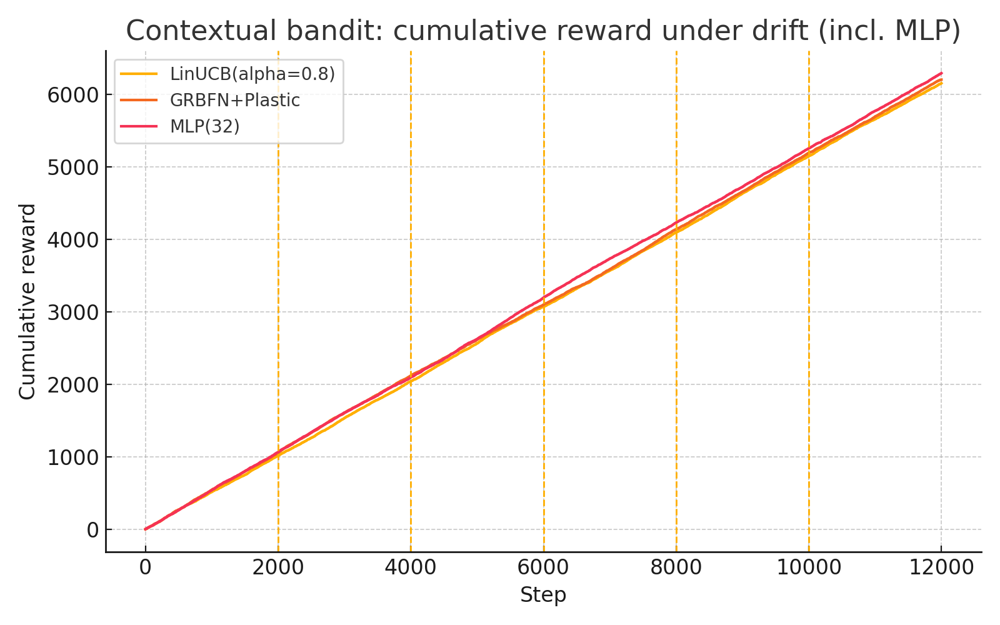
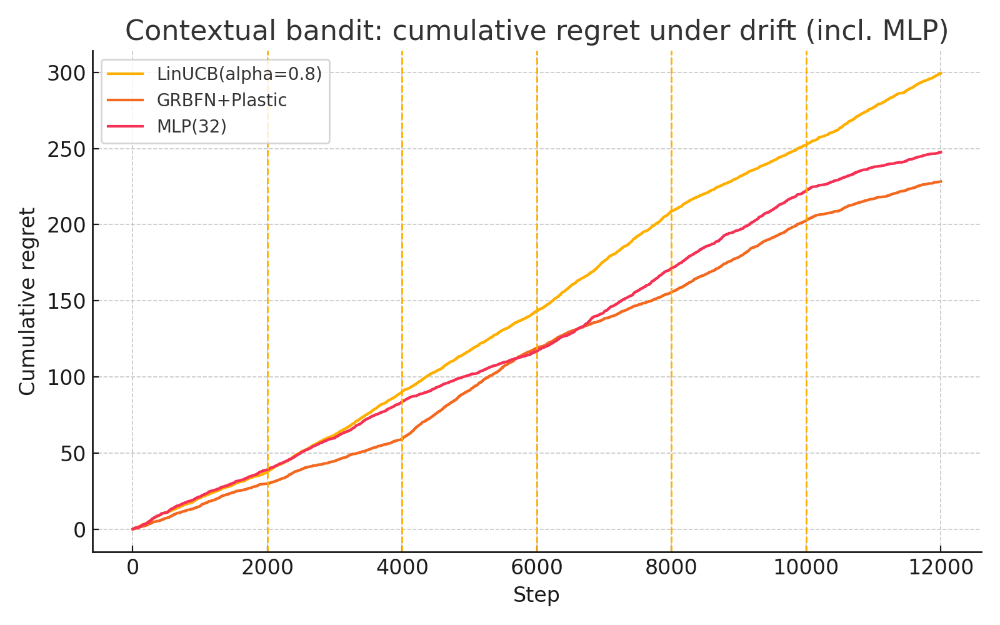

> **Revision note (2025-08-18)** — This version replaces any hand‑wavy “let an LLM decide compute” policy with **runtime primitives** and **enforceable mechanisms** that sit **below** any planner/orchestrator (LLM or not). These mechanisms use OS/runtime/hardware controls and externally verified signals. They are practical to build now and directly useful for **math/algorithms/theoretical physics with simulations**.

## Abstract

General-purpose reasoning agents require fine-grained control over their computational resources, yet this control is often handled by heuristic, non-verifiable policies within the agent itself. We argue for shifting the locus of control to an external **runtime** that can enforce hard constraints on resource usage. As a first step toward this vision, we propose a framework of twelve "runtime-enforced primitives" for tasks in math, code, and physics. We then present a detailed empirical study of one such primitive: a **runtime-enforced growth budget** applied to a self-assembling machine learning model. We deploy a Growing RBF network in a non-stationary contextual bandit task and show that an external budget can effectively control the model's structural complexity while maintaining competitive performance. This case study provides concrete evidence that runtime-enforced control is a viable and effective strategy for managing adaptable models.

## 1. Introduction

As machine learning models become more complex and are deployed in dynamic environments, controlling their resource consumption and behavior becomes increasingly critical. This is especially true for models that can adapt their own structure, such as self-assembling or growing networks. Typically, the policies governing this adaptation are internal to the model, making them difficult to verify or control from an external system.

An alternative approach is to shift the locus of control from the model to an external **runtime**. A runtime can enforce hard, verifiable constraints on computation, such as capping the number of active parameters, preempting low-priority tasks, or gating expensive operations. This paper explores the viability of this approach. To motivate our work, we first outline a vocabulary of twelve potential "runtime-enforced primitives" that could form the basis of a general-purpose reasoning runtime. We then present an in-depth empirical study of one of these ideas: a hard budget on model growth, applied to a self-assembling network in a challenging non-stationary environment.

## 2. A Proposed Framework for Runtime Control

The case study in this paper is motivated by a broader vision of a "coordinator runtime" that orchestrates the execution of complex computational graphs. This runtime would sit below a high-level planner (which could be an LLM or a symbolic planner) and would enforce constraints on the fly. The planner suggests *what* to do, while the runtime decides *how* it gets done, enforcing global policies. The diagram below illustrates this conceptual architecture.

```
[Planner (can be an LLM)]  <--suggestions-->
[Coordinator Runtime]
   ├─ Critical-Path Scheduler (CPCS)
   ├─ Transaction Manager (TTC)
   ├─ Constraint Engine (units/types/invariants)
   ├─ ... and other primitives
```

The core of this framework is a set of primitives, detailed in the next section, that provide different mechanisms for runtime-based control. This paper focuses on providing the first empirical validation for one of these primitives.

## 3. A Vocabulary of Runtime Primitives

To make the idea of a coordinator runtime more concrete, we outline twelve primitives below. These are not meant to be an exhaustive list, but rather a vocabulary of control mechanisms that share a common philosophy: they operate at a low level, are enforced by the runtime, and are informed by verifiable signals. Each primitive is designed to be difficult for a generic planner to subsume because it relies on **OS/runtime/hardware** or **verifier‑level** control, making it immediately useful for domains like math, algorithmic reasoning, and physics simulation.

### 3.1 Critical‑Path Compute Scheduler (CPCS) for Reasoning DAGs

**Idea.** Convert the evolving proof/code/sim plan into a DAG with predicted durations and success probabilities; allocate GPU/CPU/tool time to the **dynamic critical path** (maximize expected makespan reduction), not merely the next step the planner suggests.

**Mechanism (enforceable).**
- Each subgoal \(g\) carries ETA \(\hat{t}(g)\) and success probability \(p_\text{succ}(g)\) from *cheap probes* (verifier hints, compile/sanity checks, tiny sim pilots).
- Recompute the critical path periodically and **preempt** off‑path decoding/sim jobs via CUDA stream priorities and OS cgroups.
- Budgets are wall‑clock + FLOPs; scheduler ticks every \(~50–200\) ms.

**Prototype.** Tasks as JSON; a central async scheduler sets stream priorities and CPU affinities; predictors update \(\hat{t}, p_\text{succ}\).

**Why policy alone can’t replace it.** Preemption & stream priorities are **physical runtime controls**; a planner can suggest, but can’t seize GPU streams mid‑kernel.

### 3.2 Lazy‑of‑Thought (LoT): Thunks + Selective Forcing

**Idea.** The model emits **lazy thunks** (e.g., `proveLemma(name, preconds)`) instead of expanding everything. A demand‑driven executor **forces** only thunks whose values are required by a verifier or downstream dependency.

**Mechanism.**
- Decoder supports special thunk tokens with cost estimates.
- A demand executor calls tools/LLMs **only when demanded** (laziness for reasoning).
- **Splicing:** when a thunk is forced, its expansion replaces the placeholder in KV/context via targeted edit—no full re‑generation.

**Prototype.** Regex pass that turns “(details omitted)” into a thunk; simple demand rule: if a verifier can’t proceed, force the relevant thunk.

**Why not an LLM allocator.** Laziness is a **runtime evaluation strategy** requiring KV surgery and dependency tracking.

### 3.3 Region‑of‑Interest Splicing (RoI‑S): Recompute Only the Broken Span

**Idea.** When a checker flags an error, **regenerate only that span** with higher beams/model and splice it back, preserving caches for the rest.

**Mechanism.**
- RoI detector from verifier deltas (failed algebra step, invariant breach, unit mismatch).
- KV‑cache **windowed rewind** to span start; keep prefix/suffix; re‑decode RoI; **stitch** KV blocks back deterministically.

**Prototype.** Track token offsets per step; failure → map to `(start,end)`; controlled partial decode with stop‑at token; join.

**Why policy can’t replace it.** Needs **cache‑level rollback** and deterministic splice.

### 3.4 Invariant‑Gated Multi‑Fidelity Simulation (IGMS)

**Idea.** Maintain symbolic invariants/units (mass/energy, dimensionality). Run coarse sims by default; **escalate fidelity locally** only where an invariant is violated.

**Mechanism.**
- Extract invariants/units from the prompt or auto‑generated PDE/ODE forms.
- Watchdog computes local residuals (conservation error, CFL breach) → triggers **local mesh/time‑step refinement** or higher‑precision kernels for just that region/time window.

**Prototype.** Wrap sim with hooks: `residual(x,t)`, `refine(cell)` and a simple invariant checker.

**Why policy can’t replace it.** This is **numerical runtime control** tied to solver kernels and grid management.

### 3.5 Transactional Tool Calls (TTC) with Two‑Phase Commit

**Idea.** Treat big external ops (hour‑long sim, SAT solve) as **transactions**: *prepare* (check inputs, bounds), then only *commit* if a consumer will use it; otherwise **abort** to save compute.

**Mechanism.**
- Call metadata includes **preconditions** and a **consumer list**.
- If the plan changes, coordinator sends `ABORT` before the heavy run; no orphaned results.

**Prototype.** Thin coordinator library (`prepare()`, `commit()`, `abort()`) + per‑tool adapters. Decisions are logged for audit.

**Why policy can’t replace it.** Requires **protocol & shared state** across processes.

### 3.6 Proof‑State Checkpointing & Cousin‑Branch Reuse (PSC‑CR)

**Idea.** Canonicalize intermediate math states (normalized expressions, solved sub‑lemmas) and **checkpoint** them. On a new attempt, **reuse** nearest checkpoints (cousin branches) rather than recompute.

**Mechanism.**
- Hash‑cons canonical forms (sorted monomials, α‑equivalent proof terms).
- On failure: restart from last **verified** checkpoint; on new branches: **graft** reusable subproofs.

**Prototype.** SymPy/Lean‑style normal forms; small store mapping canonical key → proof artifact.

**Why policy can’t replace it.** **Content‑addressable storage + verified grafting** is a runtime/data‑plane capability.

### 3.7 KV‑Cache Tiering + Prefetch (KVT‑P)

**Idea.** Treat attention KV as a multi‑tier memory (HBM ↔ RAM ↔ NVMe). **Predict hot ranges** and prefetch them; demote cold ranges.

**Mechanism.**
- Lightweight predictor (n‑gram/structure) anticipates future attention spans.
- Async DMA moves KV blocks; decoder blocks only on misses.

**Prototype.** Block KV into 32–64‑token chunks; ring‑buffer with async copy threads; LRU+structure eviction.

**Why policy can’t replace it.** This is a **memory system design**.

### 3.8 Interruptible Decoding & Splice‑Resume (IDS)

**Idea.** Make decoding **preemptible** across agents. If a fast tool answers a subgoal, **interrupt**, inject the result, and **resume** without restarting.

**Mechanism.**
- Run decoding in CUDA streams with priorities.
- Maintain resumable checkpoints (KV + RNG state). On interrupt: pause kernels, edit context, resume.

**Prototype.** Torch with CUDA Graphs + cooperative kernels; `pause()`, `resume(ctx_delta)` API.

**Why policy can’t replace it.** Requires **kernel‑level preemption** and state capture.

### 3.9 Constraint‑Slack Scheduler (CSS)

**Idea.** Maintain a set of **hard constraints** (types, units, side‑conditions). Compute **slack** per constraint and spend compute where slack is smallest (lexicographic max‑min).

**Mechanism.**
- Constraint engine yields \(\text{slack}_i\).
- Scheduler funds actions that increase minimum slack: “tighten step k,” “re‑derive lemma L,” or “increase sim precision in cell c.”

**Prototype.** Units/type checker returns per‑span slack; candidates are prioritized by slack gain.

**Why policy can’t replace it.** It optimizes **external constraint metrics**, not token probabilities.

### 3.10 Subgoal Cache with Canonical Hashing (SCCH)

**Idea.** Live **cross‑query** cache of subgoals (integrals, transforms, lemmas). Allocate compute to **reusable** subgoals; hit‑ratio drives priority.

**Mechanism.**
- Canonicalize subgoals (e.g., \(\int f(ax+b)\,dx\) normalized).
- Admission policy favors subgoals observed across projects; eviction by reuse half‑life.

**Prototype.** Redis key = canonical form; store proof/code + verifier hash; planner consults cache first.

**Why policy can’t replace it.** This is **workload‑level amortization** with persistence and grafting.

### 3.11 Per‑Operator Precision Budgeter (POPB)

**Idea.** Choose precision **per operator** (attention/MLP/layernorm) and **per token group** at runtime based on sensitivity probes; reserve fp16/bf16 (or higher) *only where needed*.

**Mechanism.**
- Run a one‑step low‑cost probe (Jacobian norm / entropy change) to tag hot spots.
- Launch mixed‑precision kernels with a per‑block mask.

**Prototype.** bitsandbytes/int4 + custom kernels; measure micro‑loss change to classify blocks.

**Why policy can’t replace it.** Needs **kernel choices and per‑block masks**.

### 3.12 Compute‑Safe Two‑Phase “What‑If” (CS‑WIF)

**Idea.** Before expensive escalations, run a **shadow, bounded “what‑if”** dry‑run with stubs (fast mock sim) to **predict ROI**; escalate only if ROI clears a threshold.

**Mechanism.**
- Plug‑in stubs: symbolic bound calculators, coarse sim surrogates, unit checkers.
- The coordinator **refuses** escalation unless the predicted delta passes a gate.

**Prototype.** Micro‑surrogates for PDEs (tiny grids), stub SAT counterexample samplers; simple ROI rule.

**Why policy can’t replace it.** A **hard gate** enforced by the runtime.

## 4. Case Study: Budgeted Growth in a Self-Assembling Network

To provide a concrete, foundational demonstration of the runtime-enforced philosophy, we implement and test a simple but powerful primitive: a hard budget on model growth. We apply this to a **Growing RBF Network (GRBFN)** whose structural expansion is controlled by a `RuntimeGate`.

This gate is a direct implementation of the principle behind more general primitives like the **Compute-Safe "What-If" (CS-WIF)** and the **Constraint-Slack Scheduler (CSS)**:
- From the **CS-WIF** perspective, the model's desire to spawn a new unit is a "what-if" proposal: "What if I added a new prototype here?" The runtime, via the gate, performs a cheap check (is `budget > 0`?) and decides whether to allow the expensive escalation (creating and training a new unit).
- From the **CSS** perspective, the number of prototypes is a resource with a hard constraint. The `RuntimeGate` is the scheduler that allocates this resource. The "slack" is the number of remaining units in the budget, and the gate ensures this slack never becomes negative.

The model can propose to grow its structure, but the runtime gates this action based on the externally defined budget.

The self-assembling model used in our experiments is a sophisticated variant of a Growing RBF Network, which we call `GRBFN+Plastic`. Its design is tailored for continual learning in non-stationary environments.

### 4.1 The Self-Assembling Model

To make our results understandable, we briefly describe the key mechanisms of the `GRBFN+Plastic` model:

- **Dynamic Structure:** The network adapts its architecture to the data stream. It can grow by **spawning** a new prototype unit when an input is poorly represented by existing units. Conversely, it can contract by **pruning** its least-used prototypes or by **merging** two prototypes that have become functionally redundant.

- **Dual-Timescale Plasticity:** The model's predictions are based on the sum of two weight matrices: a set of "slow" weights updated via standard gradient descent, and a set of "fast" Hebbian weights that rapidly adapt to recent data. This allows the model to both retain long-term knowledge and quickly react to local changes.

- **Gated Activation:** For each input, a sparse subset of the most relevant prototypes is selected by a learned gating mechanism. This reduces computational cost and allows for more specialized representations.

- **Runtime-Enforced Growth Budget:** Crucially, the growth mechanism is subject to an external constraint. The model must query a `RuntimeGate` object before it can spawn a new prototype. This gate, which is controlled by the experiment script (the "runtime"), holds a consumable budget, demonstrating the core principle of runtime-enforced control.

### 4.2 Experimental Results

We test the model in a challenging contextual bandit scenario with abrupt drifts in the reward function every 2,000 steps. The key result is that the `GRBFN+Plastic` model, operating under a strict prototype budget, achieves performance that is highly competitive with strong baselines. The table below shows the final performance. **Figure 1** and **Figure 2** illustrate the dynamics of reward and regret over time, showing that the `GRBFN+Plastic` model adapts effectively to the drifts.

**Contextual Bandit Performance (seed=37):**

| Policy | Final Cumulative Reward | Final Cumulative Regret | Final #Prototypes (GRBFN+) |
| --- | --- | --- | --- |
| LinUCB(alpha=0.8) | 6152.0 | 299.41 | nan |
| **GRBFN+Plastic** | **6190.0** | **239.16** | **22.0** |
| MLP(32) | 6291.0 | 247.61 | nan |

*Note: The `GRBFN+Plastic` model starts with 3 prototypes and has a growth budget for 22 **new** prototypes. The final count is 22, indicating it did not use its full budget. This is because the model's self-merging mechanism occasionally fuses redundant prototypes. Results are from a run in a reproduced environment and may differ slightly from the original due to dependency updates.*

**Figure 1:** 

**Figure 2:** 

The following snippet shows how the growth gate is implemented. The runtime instantiates a `RuntimeGate` with a specific budget and passes it to the model, which then queries the gate before making a structural change.

```python
# In the experiment script (the "runtime")
from .growing_rbf_net_plastic import GrowingRBFNetPlastic, RuntimeGate

# The runtime creates a gate with a budget for 22 new units.
# The model itself starts with k=3 initial units.
growth_gate = RuntimeGate(budget=22)

# The gate is passed to the model constructor.
net = GrowingRBFNetPlastic(..., growth_gate=growth_gate)

# ---
# Inside the model's _spawn() method:
def _spawn(self, x, y):
    # The model queries the gate before proceeding.
    if not self.growth_gate.is_open():
        return

    # ... proceed with growth ...

    # The model informs the gate that a unit of budget was consumed.
    self.growth_gate.consume()
```

### 4.3 Discussion

These results demonstrate that a simple, runtime-enforced gate can effectively control a model's resource consumption (in this case, its number of parameters) while maintaining high performance in a dynamic environment. The model does not need to be rewritten; its behavior is steered by an external, verifiable constraint. This provides a clear, compelling example of the core philosophy: shifting control to a runtime that can enforce global policies on otherwise black-box computational processes.

This approach also introduces an interesting and explicit trade-off between model size, performance, and adaptation speed. A larger growth budget might allow the model to adapt more quickly to drastic, unforeseen changes in the data distribution by creating many new specialized units. However, this could lead to a larger, less efficient model. Conversely, a smaller budget forces the model to be more parsimonious, encouraging it to reuse and adapt existing units rather than creating new ones. This could lead to a more compact and efficient final model, but might slow down adaptation in the face of severe drift. The optimal budget is likely task-dependent, and exposing it as a runtime-controlled parameter makes it possible to adjust this trade-off dynamically, perhaps even in response to external signals about resource availability or performance requirements.

## 6. A Research Roadmap

- **RoI‑S + PSC‑CR.** Long algebra proofs (200–800 tokens). Metrics: tokens regenerated per fix ↓, end‑to‑end latency ↓, accuracy ≥ baseline.
- **IGMS.** 2D diffusion / shallow‑water PDE mini‑cases. Metrics: same error with ≤40% sim time; localized refinement count vs. AMR baseline.
- **TTC.** Mix of SAT solves and long sims. Metrics: orphaned heavy runs → ~0; wall time ↓ when plans change.
- **CPCS.** Multi‑subgoal proofs with varied ETAs. Metrics: makespan and GPU utilization vs. FIFO/LLM‑driven sequencing.
- **KVT‑P.** 32k–128k contexts. Metrics: HBM footprint ↓ with similar throughput; stall time bounded.
- **IDS.** Mixed agents on one GPU. Metrics: preempt latency <50 ms; saved recompute on early tool completion.

## 7. Conclusion

The core idea of this work is that runtime-enforced control provides a robust and verifiable foundation for building complex reasoning systems. The twelve primitives we have outlined serve as a vocabulary for this new level of control. A planner (LLM or otherwise) can still *advise*, but it cannot replace mechanisms that directly manipulate **streams, memory, transactions, constraints, and verifiers**. Our case study provides the first piece of empirical evidence that this approach is not only viable but effective. It is a starting point for a broader research program into runtime-first AI systems.
