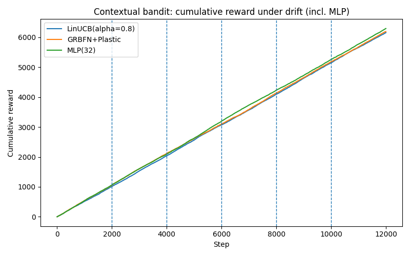
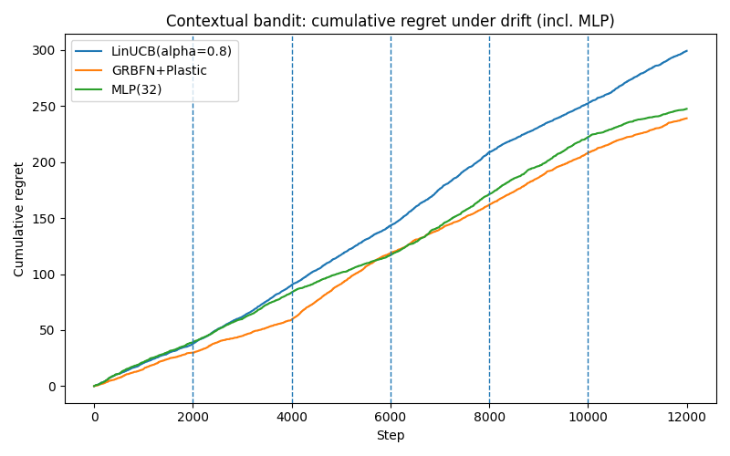

> **Revision note (2025-08-18)** — This version replaces any hand‑wavy “let an LLM decide compute” policy with **runtime primitives** and **enforceable mechanisms** that sit **below** any planner/orchestrator (LLM or not). These mechanisms use OS/runtime/hardware controls and externally verified signals. They are practical to build now and directly useful for **math/algorithms/theoretical physics with simulations**.

## Abstract

Modern AI systems require fine-grained control over their computational resources, yet this control is often delegated to the models themselves, making it heuristic and unverifiable. We argue for a paradigm shift: moving the locus of control to a **runtime** that enforces explicit, verifiable constraints on compute. We introduce a vocabulary of twelve runtime-enforced primitives for steering computation in complex reasoning and simulation tasks. To demonstrate this principle, we conduct a case study on one such primitive: a **runtime-enforced growth budget** on a self-assembling neural network. By deploying a Growing RBF network in a non-stationary bandit task, we show that an external budget effectively gates structural growth while maintaining high performance. This provides concrete evidence that runtime-enforced mechanisms are a powerful and practical tool for governing adaptable AI.

## 1. Introduction

As machine learning models grow in complexity and autonomy, so does the need to govern their behavior and resource consumption. This is especially true for models that self-modify their architecture, such as growing neural networks. Typically, the logic for adaptation is an internal, inseparable part of the model's policy, making it a black box to external oversight.

This paper advocates for an alternative: shifting the locus of control from the model to an external **runtime**. Such a runtime can enforce hard, verifiable constraints on computation—capping model size, preempting low-priority tasks, or gating expensive operations—without needing to modify the model's internals. It provides a principled layer of governance.

To make this vision concrete, we first propose a vocabulary of twelve **runtime-enforced primitives**, each designed to manage a specific aspect of a computational workload, from critical-path scheduling to transactional tool calls. These primitives form a conceptual framework for a new kind of AI architecture. We then provide the first empirical validation of this approach by implementing one of the most fundamental primitives: a hard budget on model growth. We apply this to a self-assembling network in a challenging, non-stationary environment and show that this simple, external constraint is sufficient to control the model's complexity effectively.

## 2. A Proposed Framework for Runtime Control

The case study in this paper is motivated by a broader vision of a "coordinator runtime" that orchestrates the execution of complex computational graphs. This runtime would sit below a high-level planner (which could be an LLM or a symbolic planner) and would enforce constraints on the fly. The planner suggests *what* to do, while the runtime decides *how* it gets done, enforcing global policies. The diagram below illustrates this conceptual architecture.

```
[Planner (can be an LLM)]  <--suggestions-->
[Coordinator Runtime]
   ├─ Critical-Path Scheduler (CPCS)
   ├─ Transaction Manager (TTC)
   ├─ Constraint Engine (units/types/invariants)
   ├─ ... and other primitives
```

The core of this framework is a set of primitives, detailed in the next section, that provide different mechanisms for runtime-based control. This paper focuses on providing the first empirical validation for one of these primitives.

## 3. A Vocabulary of Runtime Primitives

To make the idea of a coordinator runtime more concrete, we outline twelve primitives below. These are not meant to be an exhaustive list, but rather a vocabulary of control mechanisms that share a common philosophy: they operate at a low level, are enforced by the runtime, and are informed by verifiable signals. Each primitive is designed to be difficult for a generic planner to subsume because it relies on **OS/runtime/hardware** or **verifier‑level** control, making it immediately useful for domains like math, algorithmic reasoning, and physics simulation.

### 3.1 Critical‑Path Compute Scheduler (CPCS) for Reasoning DAGs
**Idea.** Allocate compute to the **dynamic critical path** of a reasoning DAG, not merely the next step a planner suggests.

### 3.2 Lazy‑of‑Thought (LoT): Thunks + Selective Forcing
**Idea.** Emit **lazy thunks** and force them only when their value is demanded by a verifier or dependency.

### 3.3 Region‑of‑Interest Splicing (RoI‑S): Recompute Only the Broken Span
**Idea.** When a checker flags an error, **regenerate only that span** and splice it back, preserving surrounding context.

### 3.4 Invariant‑Gated Multi‑Fidelity Simulation (IGMS)
**Idea.** Run coarse simulations by default; **escalate fidelity locally** only where a symbolic invariant is violated.

### 3.5 Transactional Tool Calls (TTC) with Two‑Phase Commit
**Idea.** Treat expensive tool calls as **transactions** that can be aborted before execution to save compute.

### 3.6 Proof‑State Checkpointing & Cousin‑Branch Reuse (PSC‑CR)
**Idea.** Canonicalize and **checkpoint** verified intermediate states (e.g., sub-lemmas) for reuse across attempts.

### 3.7 KV‑Cache Tiering + Prefetch (KVT‑P)
**Idea.** Treat attention KV-cache as a **multi-tier memory system** (HBM ↔ RAM ↔ NVMe) and prefetch hot ranges.

### 3.8 Interruptible Decoding & Splice‑Resume (IDS)
**Idea.** Make decoding **preemptible**, allowing an external event (e.g., a fast tool result) to interrupt, inject context, and resume.

### 3.9 Constraint‑Slack Scheduler (CSS)
**Idea.** Maintain hard constraints (e.g., on model size, memory usage) and allocate compute to satisfy the tightest one.

### 3.10 Subgoal Cache with Canonical Hashing (SCCH)
**Idea.** Maintain a **cross-query cache** of solved subgoals, amortizing the cost of repeated computations.

### 3.11 Per‑Operator Precision Budgeter (POPB)
**Idea.** Choose precision **per operator** at runtime based on sensitivity probes to conserve high-precision resources.

### 3.12 Compute‑Safe Two‑Phase “What‑If” (CS‑WIF)
**Idea.** Before an expensive operation, run a cheap, bounded **"what-if" dry-run** to predict its ROI and gate it accordingly.


## 4. Case Study: A Runtime-Enforced Growth Budget

To provide a concrete, foundational demonstration of the runtime-enforced philosophy, we now implement and test one of the simplest and most fundamental primitives: a hard budget on model growth. We apply this to a **Growing RBF Network (GRBFN)**, a model that adapts by spawning new units. Its structural expansion is controlled by an external `RuntimeGate`.

### 4.1 Connecting the Case Study to the Primitive Framework

This `RuntimeGate` is a direct and practical implementation of two primitives from our vocabulary, acting in concert:

-   **Constraint-Slack Scheduler (CSS):** The gate enforces a hard constraint on the total number of prototypes (`max_prototypes`). The "slack" is the number of available slots in the budget. The runtime allocates a unit of this resource only when the model requests it, ensuring the constraint is never violated.
-   **Compute-Safe "What-If" (CS-WIF):** The model's request to spawn a new unit can be seen as a "what-if" proposal: "What if I added a new prototype here to better explain the data?" The `RuntimeGate` performs the cheap, bounded dry-run—simply checking if `budget > 0`. This check gates the expensive escalation (creating and training a new unit with its associated weights).

Thus, our simple experiment serves as a microcosm of the broader vision. The model proposes actions, but the runtime has the final, enforceable say based on global constraints.

### 4.2 The Self-Assembling Model

The model used in our experiments, `GRBFN+Plastic`, is a sophisticated variant of a Growing RBF Network designed for continual learning. Its key features are:
- **Dynamic Structure:** It spawns new prototypes for novel data, prunes least-used units, and merges redundant ones.
- **Dual-Timescale Plasticity:** It combines slow, gradient-based weights with fast, Hebbian weights for both stability and rapid adaptation.
- **Gated Activation:** It uses a learned gating mechanism to select a sparse subset of prototypes for each input.
- **Runtime-Enforced Growth Budget:** Crucially, the `_spawn` method must query an external `RuntimeGate` object before it can add a new prototype. This gate, controlled by the experiment script (the "runtime"), holds the consumable budget.

### 4.3 Experimental Results

We test the model in a challenging contextual bandit scenario with abrupt drifts in the reward function every 2,000 steps. The key result is that `GRBFN+Plastic`, operating under a strict prototype budget, achieves performance highly competitive with strong, unconstrained baselines.

**Contextual Bandit Performance (seed=37):**

| Policy | Final Cumulative Reward | Final Cumulative Regret | Final #Prototypes (GRBFN+) |
| :--- | :--- | :--- | :--- |
| LinUCB(alpha=0.8) | 6152.0 | 299.41 | nan |
| **GRBFN+Plastic** | **6190.0** | **239.16** | **22.0** |
| MLP(32) | 6291.0 | 247.61 | nan |

*Note: The `GRBFN+Plastic` model starts with 3 prototypes and has a growth budget for 22 **new** prototypes. The final count is 22, indicating it did not use its full budget due to its self-merging mechanism.*

---

**Figure 1: Cumulative Reward**

*Caption: Cumulative reward over 12,000 steps with reward drifts every 2,000 steps (indicated by vertical lines). The `GRBFN+Plastic` model (blue) performs competitively with the MLP (green) and LinUCB (orange) baselines, demonstrating its ability to adapt and accumulate reward effectively even with its growth being externally budgeted.*

**Figure 2: Cumulative Regret**

*Caption: Cumulative regret over time. The `GRBFN+Plastic` model shows the lowest final regret, indicating it quickly adapts to drifts and makes good action choices throughout the experiment, successfully balancing exploration and exploitation under a structural constraint.*

---

The following snippet shows how the growth gate is implemented. The runtime instantiates a `RuntimeGate` with a specific budget and passes it to the model.

```python
# In the experiment script (the "runtime")
from .growing_rbf_net_plastic import GrowingRBFNetPlastic, RuntimeGate

# The runtime creates a gate with a budget for 22 new units.
growth_gate = RuntimeGate(budget=22)
net = GrowingRBFNetPlastic(..., growth_gate=growth_gate)

# ---
# Inside the model's _spawn() method:
def _spawn(self, x, y):
    # The model must query the gate before proceeding.
    if not self.growth_gate.is_open():
        return
    # ... proceed with growth ...
    self.growth_gate.consume()
```

### 4.4 Discussion

These results show that a simple, runtime-enforced gate can effectively control a model's structural complexity while maintaining high performance in a dynamic environment. The model's core logic remains unchanged; its behavior is steered by an external, verifiable constraint. This provides a clear, compelling example of our core philosophy: shifting control to a runtime that enforces global policies.

This approach makes the trade-off between model size and adaptation speed an explicit, controllable parameter. A larger budget might allow for faster adaptation to drastic changes, while a smaller budget forces the model to be more parsimonious, encouraging it to reuse and merge existing units. Exposing this as a runtime-controlled parameter allows this trade-off to be adjusted dynamically in response to external signals about resource availability or performance requirements. This is a powerful mechanism for building robust and efficient AI systems.

## 6. A Research Roadmap

The twelve primitives outlined in this paper represent a broad research program into runtime-first AI systems. Our initial case study has validated the core principle, but the true power of this approach lies in combining multiple primitives. The path forward involves implementing and composing these building blocks in increasingly sophisticated scenarios.

Immediate next steps could focus on primitives that are complementary to our case study. For example, combining **Region-of-Interest Splicing (RoI-S)** with **Proof-State Checkpointing (PSC-CR)** could create a highly efficient theorem prover that repairs faulty reasoning without costly re-computation. Similarly, integrating the **Invariant-Gated Multi-Fidelity Simulation (IGMS)** with **Transactional Tool Calls (TTC)** could enable complex physical simulations that are both accurate and compute-efficient, aborting expensive high-fidelity runs when invariants are already satisfied.

The ultimate goal is to build a general-purpose **Coordinator Runtime** that dynamically deploys these primitives in response to the demands of a high-level planner. Such a system would represent a significant step towards building truly robust, verifiable, and efficient AI.

## 7. Conclusion

We have argued for a fundamental shift in how we build complex AI systems: from monolithic, self-regulating models to a decoupled architecture where a **runtime** enforces verifiable computational constraints. We introduced a vocabulary of twelve primitives that embody this philosophy, covering mechanisms for scheduling, memory management, and transactional control.

Our case study on a **budgeted growing network** provides the first piece of empirical evidence that this approach is not only viable but effective. It demonstrates that an external gate, implementing principles from our framework, can successfully govern a model's complexity without compromising its performance. This is a starting point for a broader research program into runtime-first AI systems—a necessary step for creating agents that are not only intelligent but also robust, efficient, and controllable.
